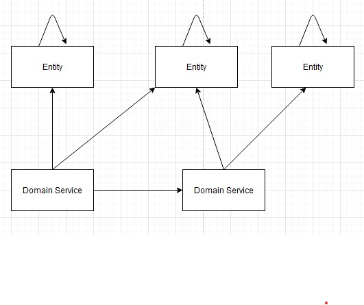
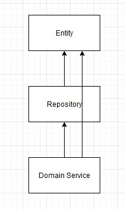

# DDD Math

本文主要从代码的数学结构上来分析DDD的战术方面，顺带分析DDD的战略方面。

## 基本概念

Entity（Root Entity or Aggregate Root）：首先，任何软件系统都应当拥有实体。不是因为数据库要求我们具备实体，而是因为实体是我们建模的基础。是数据库为实体而设计，而不是数据库要求我们拥有实体。

Repository：既然有了实体，那么我们就应当需要保存实体和获取实体的途径。其实repository是一个**很薄的概念**。与其把它和数据库放一块，不如认为它是一种**存取实体**的方法——呼之即来，挥之即去。由于我认为它是一个非常薄的概念，所以我在下文会淡化Repository这一概念，取而代之的是“存取”。

Domain Service：在Entity上进行进一步的封装，并且能够存取实体。

## 限界上下文内部——战术方面

首先，在一个Bounded Countext内部，DDD的规则会为我们的架构带来复杂性的降低。

DDD通过分层的规定，形成了以下限制，从而降低复杂性：
1. 实体不能调用其他实体
2. Domain Service可以调用任何实体
3. Domain Service可以调用其他Domain Service
3. 实体不能调用Domain Service

在一个BC内部，DDD做出的限制体现在下图：

为了更好理解这种限制，我们应该对Entity的方法、DomainService的方法的本质进行探索。

所谓方法，从c语言的角度来看，其本质就是函数。其区别在于传入的参数。由这种视角，我们可以做出以下总结：

**规律**

在单个BC中，DDD对函数的种类进行了显式的分类。这些分类如下：
1. 函数的参数只涉及单个实体（可能偶尔会涉及其他值对象）
2. 函数的参数涉及多个实体，或者有参数提供了存取实体的能力，或者其他第2类函数作为参数

<!-- 这里，我们可以观察出单纯的模块化和DDD的联系和区别。 -->

**解释**

“实体们，你们只需要管理好自己的属性就行了，并且保证良好的封装性，向外提供方法。”

“领域服务们，你们拥有存取实体的权利，还可以处理多个实体的传入参数”

这就好像实体是封装精良的提线木偶，专注于将对自身属性的操作封装成方法。领域服务则是建立在存取实体、调用实体方法的基础之上的存在。

**变形-劣势**

如果让实体的方法能够进行存取实体，或者调用其他实体，那么从代码结构上来看，就会体现为方法代码位置的移动。

移动之后，有可能会带来测试的不便，以及维护的不便（其实这些不便貌似都挺好解决）。

值得注意到的是，为什么我对劣势有点轻描淡写？是因为：在刚刚描述的代码移动的过程当中，我们的模块化程度还是保持不变。

那我们就会继续想：什么情况下，模块化程度会被影响？如果我们将本该属于两类的2个方法，融合成了一个后，那么模块化程度就会受到影响。本来那2个方法是属于2个不同的层的，直觉再迟钝的开发人员，只要遵循死的DDD约束，也能够100%避免将2个该分离的方法进行融合。但是，如果不加DDD的限制，那么这个概率就可能只有20%。在这种情况下，也许只有那些直觉强大的开发人员能够做好模块化。

**结论**

在单个BC中，DDD带给我们的，在本质上是一种进行模块化的方法。它既为直觉差的开发人员提供了一个最低的保障（下限），也为直觉好的开发人员锦上添花。

它进行模块化的方法，就是将函数按照传入参数的不同进行分类。有了这些分类（当前是2个），就可以为模块化提供保障。

**启发**

我们可以对函数进行更加细致的分类：
1. 函数的参数只涉及单个实体（可能偶尔会涉及其他值对象）
2. 函数的参数涉及多个实体
3. 函数的参数涉及多个实体，并且提供了存取实体的能力，并且具备调用(2)(3)的能力

通过上面这样的改进，我们的模块化又可以做的更好

**你们眼中的DDD**

回头看看，是不是觉得你们的理解很肤浅？

**万恶之源**

万恶之源在于模块化。在于模块化.md的那2条结论。

## BC间的

那么，BC间有什么限制吗？

BC间还是涉及到Entity和Domain Service。

在Martin Fowler的https://martinfowler.com/bliki/BoundedContext.html 中，他提到了DDD deals with large models by dividing them into different Bounded Contexts and **being explicit about their interrelationships** .

函数依赖的角度来看，BC间的互动如下：
1. Entity（和ValueObject）的传递
2. Domain Service的调用

<!-- **单向依赖**

请注意，BC间的依赖应当是单向的。BC间不能有双向的调用关系上的依赖。如果是双向的依赖，就应当考虑放在一个BC里面。

但是，两个BC依赖于同一个概念，是可以的。例如，RecordService有CreateRecord方法，而RateLimitService有LimitCreateRecord方法（限制创建record的速度）。RecordService.RecordService会调用RateLimitService.LimitCreateRecord。乍一看，这形成了双向依赖，但其实概念上的真正的依赖关系是这样的：两个服务共同依赖于“CreateRecord”这一概念。 -->

**模块化视角**

以模块化的视角来看：模型太大了，需要拆分。拆分需要明确定义它们之间的关联。还是模块化的2个定律的应用：小模块比大模块好，但是模块要高内聚低耦合。如果低耦合，那么关联很容易明确定义。如果按照领域拆分得当，那么高耦合的性质也会获得。
